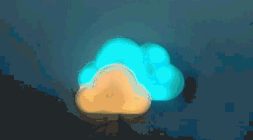
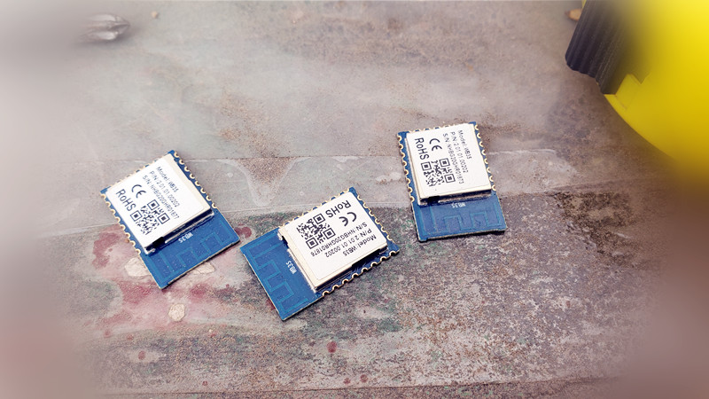
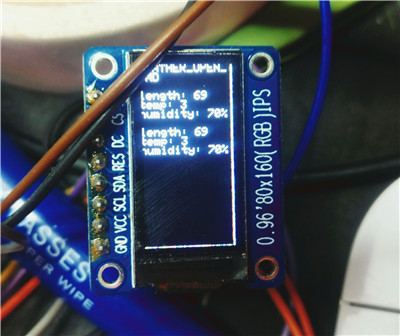
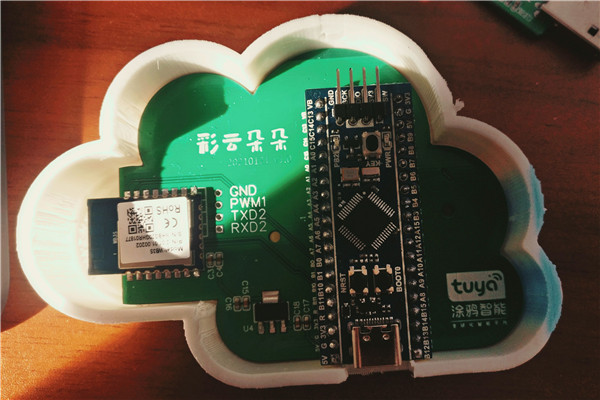
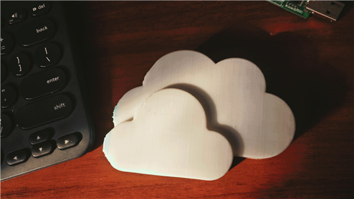
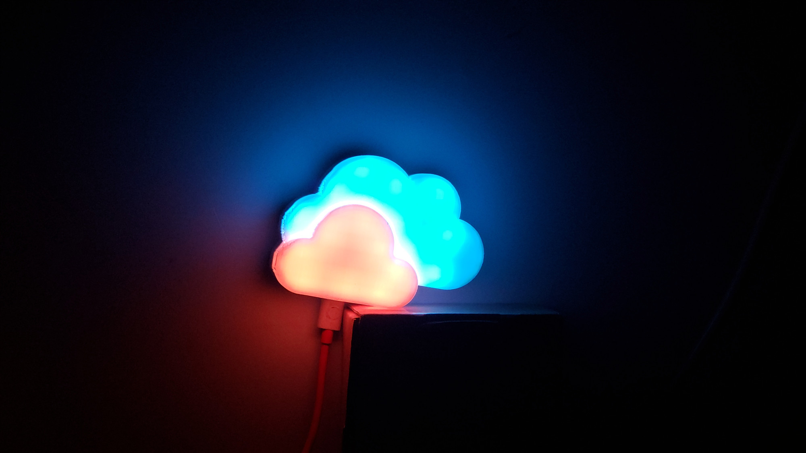

[[中文版]](README_cn.md)

This project is developed using Tuya SDK,which enables you to quickly develop branded apps connecting and controlling smart scenarios of many devices.

For more information,please check [Tuya Developer Website](https://developer.tuya.com/).

## Introduce

- Mainly through sht30 to monitor the indoor temperature and humidity, and upload to the cloud platform, you can view it at any time through the app
- The two clouds represent the indoor and outdoor temperature and humidity respectively, and show the difference of indoor and outdoor environment by displaying different colors of RGB lamp beads
- The connection status of the network can also be displayed through different display effects
- Good fortune
- For home decoration

## Video

[BiliBIli](https://www.bilibili.com/video/BV18K4y1p78z)

## Hardware

WB3S WiFi&BLE Module ：1.1.71

[SHT30](https://item.szlcsc.com/78489.html)

[BluePill](https://github.com/WeActTC/BluePill-Plus)

[TC3838RGB](https://item.szlcsc.com/839901.html)

[PCB](https://oshwhub.com/kakaka/tu-ya-zhi-neng-yun-duo)

## Software

Tuya MCU SDK ：v2.5.6

VS Code + PlatformIO + Arduino

 Source code：[software](software)

## Screenshot

## License

[MIT](https://github.com/Modular-X-01/diy-tuya-cloud-sw/blob/main/LICENSE)