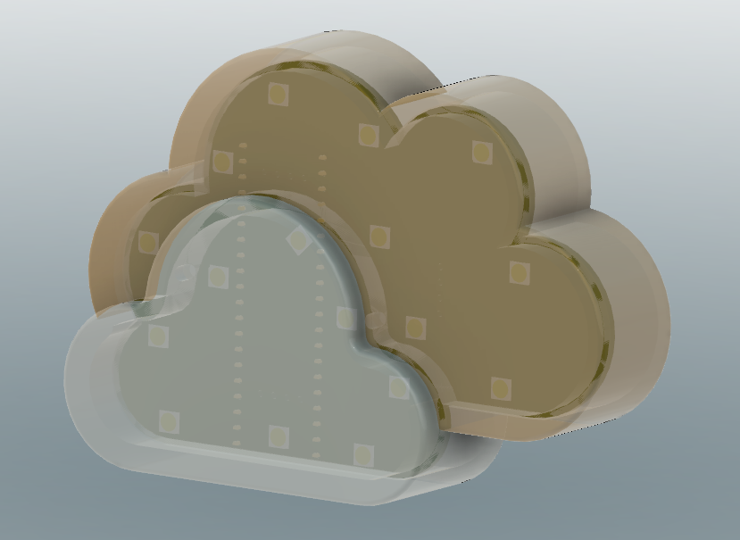
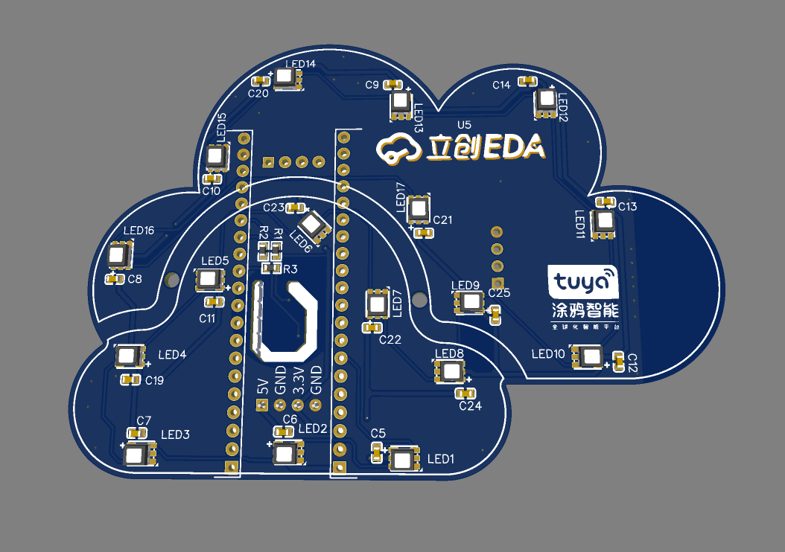

[[English]](README.md)

# 彩云朵朵

这个项目是使用涂鸦 SDK开发的，它使您能够快速开发连接和控制多种设备的智能场景的APP。

欲了解更多信息，请查看[涂鸦开发者网站](https://developer.tuya.com/)。

## 介绍

- 主要是通过sht30来监测室内温湿度，并上传到云平台，可以随时通过APP来查看
- 两片云朵分别代表室内外的温湿度，通过RGB灯珠显示不同颜色来表现室内外环境差异
- 对于网络的连接状态也可以通过不同的显示效果展示出来
- 财运多多【谐音】
- 作为家庭装饰用

## 视频

[BiliBili](https://space.bilibili.com/204526879)

## 硬件

WB3S WiFi&BLE 双协议模组 ：1.1.71

[SHT30](https://item.szlcsc.com/78489.html)

[BluePill](https://github.com/WeActTC/BluePill-Plus)

[TC3838RGB](https://item.szlcsc.com/839901.html)

[PCB](https://oshwhub.com/kakaka/tu-ya-zhi-neng-yun-duo)

## 软件

涂鸦标准模组MCU SDK ：v2.5.6

VS Code + PlatformIO + Arduino

 源代码在[software](software)文件夹

## 截图

## 开源协议

[MIT](https://github.com/Modular-X-01/diy-tuya-cloud-sw/blob/main/LICENSE)